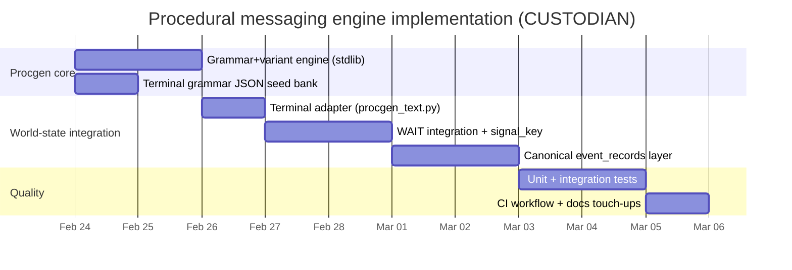

# Procedural Generation Engine for CUSTODIAN

## Executive summary

### Assumptions and explicitly unknown details

- The primary simulation/runtime language is **Python** and the terminal UI is **JavaScript/HTML/CSS**, based on the repository’s own README and structure notes. fileciteturn30file9L1-L1
- The authoritative “world-state” implementation lives under `game/simulations/world_state/`, with the terminal command loop routing through `terminal/processor.py`, and `WAIT` implemented in `terminal/commands/wait.py`. fileciteturn62file0L1-L1 fileciteturn61file2L1-L1 fileciteturn65file1L1-L1
- The detailed “procedural messaging engine” described in planning/audit docs is **not yet implemented**, and `WAIT` currently uses fixed, fidelity-gated strings (minimal templating). fileciteturn58file9L1-L1 fileciteturn65file1L1-L1
- CI configuration is **not discoverable via the available tooling** (no indexed workflow files found in search). Therefore CI changes below are proposed and may require alignment with your preferred runner version(s) and dependency approach.

### What this implementation delivers

This design implements a **deterministic, seed-driven grammar + variant engine** and wires it into the **world-state terminal layer**, focusing first on `WAIT` because it is the system’s “procedural messaging surface” and is already fidelity-gated. fileciteturn65file1L1-L1 fileciteturn58file0L1-L1

Key properties:

- **Deterministic output under seed** (and optionally a separate “text seed”), consistent with the project’s documented emphasis on deterministic simulation authority. fileciteturn62file0L1-L1 fileciteturn60file0L1-L1
- **High variation without changing mechanics**: multiple phrasings for the same semantic signal (event detected, warning, status shift), while preserving locked operational tone and fidelity restrictions. fileciteturn58file0L1-L1 fileciteturn60file1L1-L1
- **No-repeat suppression remains correct even with variation** by switching the `WAIT` suppression mechanism from comparing the rendered *line* to comparing a stable *signal key* (semantic identity). This prevents variation from defeating deduplication. fileciteturn65file1L1-L1 fileciteturn50file25L1-L1
- A **data-driven grammar file** (`terminal_grammar.json`) plus an adapter (`procgen_text.py`) so content changes do not require touching Python code.

The implementation is grounded in established grammar-based PCG and author-focused generative text systems (CFG/L-systems/shape grammars as foundations; practical authoring via Tracery; PCG surveys and grammar applications). citeturn10search0 citeturn10search11 citeturn14view0 citeturn11search0 citeturn19search30

## Repository context and constraints

The world-state architecture is built around a single mutable `GameState` and tick advancement through `step_world`, with terminal commands acting as a read-only projection (except where commands mutate state). fileciteturn59file0L1-L1 fileciteturn62file0L1-L1 fileciteturn61file2L1-L1

In the existing implementation:

- `WAIT` advances **5 ticks per unit** in normal operation (and 1 tick per unit during active assault), with output lines derived per-tick and aggregated, including a built-in suppression of repeated blocks. fileciteturn65file1L1-L1 fileciteturn50file25L1-L1
- Fidelity (“FULL / DEGRADED / FRAGMENTED / LOST”) is computed from comms effectiveness, and `WAIT`/`STATUS` are expected to respect fidelity constraints. fileciteturn59file6L1-L1 fileciteturn58file0L1-L1
- The event system (`core/events.py`) produces ambient events with a probability influenced by threat; detection is also probability-gated. fileciteturn60file0L1-L1

The central design constraint is that **the simulator must remain authoritative and deterministic**, while the message layer can be highly variable but **must not** become non-repeatable or “LLM-like” in a way that breaks trust or fidelity rules. This matches the repository’s design intent: *simulation authority first; terminal projection second* and the “information degradation” theme. fileciteturn62file9L1-L1 fileciteturn58file0L1-L1

## Design decisions and alternatives

### Decision drivers

1. **Determinism and replayability**: identical seeds and command streams should yield identical output streams unless a separate “text seed” is intentionally used. fileciteturn62file0L1-L1
2. **Fidelity gating is non-negotiable**: FRAGMENTED and LOST must not leak subsystem identities or actionable precision; FULL may. fileciteturn58file0L1-L1
3. **Low coupling**: simulation code should not import/know about “string banks” beyond producing semantic signals.
4. **Authorable content**: grammar and variants should live in a data file, not hard-coded conditionals, to realize the stated “procedural messaging engine” goal. fileciteturn58file9L1-L1

### High-level chosen approach

A **two-layer system**:

- **Canonical signal layer (mechanics-owned)**: the simulation produces semantic facts like “event triggered: power_brownout; detected: true; fidelity: DEGRADED; tick: 120”.
- **Narrative surface layer (terminal-owned)**: a renderer maps those facts into a *symbol* (e.g., `wait.event.degraded`) and expands that symbol using a **grammar/variant engine** with anti-repetition memory. fileciteturn60file1L1-L1 fileciteturn58file9L1-L1

This follows the general pattern described (in different domains) by grammar-based PCG: an abstract generative structure that is deterministically rewritten into a surface artifact. The lineage includes CFG rewriting concepts (and generalizations like L-systems and shape grammars) and PCG practice in games. citeturn10search0 citeturn10search11 citeturn11search0

### Alternatives considered

| Alternative | Description | Pros | Cons | Fit for CUSTODIAN |
|---|---|---|---|---|
| Hard-coded templates only | Expand `wait.py` with more `if fidelity == ...` branches and lists | Minimal new code | Unmaintainable; variation still repetitive; no authoring surface | Weak |
| JSON variant banks without grammar | A “choose one string from list” per signal type | Simple; data-driven; deterministic | Limited composability; tends toward combinatorial variant lists | Medium |
| Custom CFG-style grammar + variants (selected) | Symbols expand to strings that can contain other symbols; weighted variant selection | Scales authoring; shared lexicons; controlled tone | Engine complexity; needs careful determinism | Strong |
| Adopt Tracery directly | Use an existing Tracery implementation/library | Proven author workflow; supports modifiers | Adds dependency and “foreign” semantics; still need fidelity gating & deterministic seeding discipline | Medium |
| Full narrative scripting (Ink-like) | Use a narrative DSL and compiler/runtime, treating signals as story triggers | Powerful authoring, stateful narrative | Overkill; mismatched to terse operational terminal; heavy integration | Low |

Author-focused generative text tools like Tracery are a strong inspiration for grammar usability and modifiers; the selected design reimplements a minimal subset to keep dependencies and determinism under your control. citeturn14view0 citeturn12search2

### Determinism strategy

A common failure mode in procedural text is variability depending on call order (“how many random calls happened earlier”). The chosen strategy eliminates that by:

- Using **stable hashing** (e.g., BLAKE2b-64) to derive a local PRNG seed from `(text_seed, symbol_name, salt)` so each rendered signal has a deterministic RNG independent of other signals.
- Keeping a **small per-session anti-repetition memory** keyed by symbol (or symbol family) so repeated signals don’t repeat the same variant.

This preserves deterministic replay while improving perceived variety.

## Architecture and data model

### Architecture diagram

```mermaid
flowchart TD
  A[Simulation tick: step_world] --> B[Signal production: events/assault/repairs/fidelity]
  B --> C[Canonical signal facts\n(event_key, detected, etc.)]
  C --> D[Terminal observation\nWAIT tick aggregation]
  D --> E[Procgen adapter\nselect symbol by fidelity]
  E --> F[Grammar + variant engine\nexpand + choose variant]
  F --> G[Rendered terminal lines]
  G --> H[Dedup/suppression by semantic signal_key]
  H --> I[CommandResult payload]
```

### Why “signal_key” is required

`WAIT` already suppresses repeated blocks, but it currently compares the **rendered first line** of a tick to the last seen line. fileciteturn65file1L1-L1  
Once you introduce variant phrasing, identical signals would produce different first lines, and suppression would fail (spam). Therefore, the suppression comparison must switch to a stable semantic identifier: `signal_key = "event:<event_key>"` or `signal_key = "repair:<structure_id>"`, etc.

This is a design improvement even beyond procgen: it makes the output contract more robust.

### Example grammar/variant rules

This is a minimal “Tracery-like” CFG expansion style: symbols are referenced as `#symbol#`. Modifiers (like `.upper`) are applied via `#event_name.upper#`.

Example conceptual definition (JSON):

```json
{
  "symbols": {
    "wait.event.full": [
      { "text": "[EVENT] #event_name.upper# DETECTED", "weight": 5 },
      { "text": "[EVENT] #event_name.upper# CONFIRMED", "weight": 3 }
    ],
    "wait.event.fragmented": [
      { "text": "[EVENT] IRREGULAR SIGNALS DETECTED", "weight": 5 },
      { "text": "[EVENT] SIGNAL FRAGMENTS RECORDED", "weight": 2 }
    ]
  }
}
```

This approach is aligned with author-focused generative text tooling (Tracery) as well as broader grammar-based PCG techniques. citeturn14view0 citeturn11search0

## Implementation plan

### Step-by-step plan with concrete file changes

The goal is to land this in coherent slices so that each PR/commit is testable and low-risk, consistent with the repo’s “keep entry points stable; avoid large all-at-once rewrites” guidance. fileciteturn64file8L1-L1

**Slice one: grammar engine library**

- Add `game/procgen/engine.py` (pure stdlib).
- Add `game/procgen/__init__.py`.
- Add `game/simulations/world_state/content/terminal_grammar.json` (initial bank).

**Slice two: world-state adapter**

- Add `game/simulations/world_state/terminal/procgen_text.py` (loads JSON bank, exposes render functions).

**Slice three: integrate into WAIT**

- Modify `game/simulations/world_state/terminal/commands/wait.py`:
  - Replace `_format_*` functions to call procgen renderer.
  - Replace suppression comparator from `signal_line` to `signal_key`.
  - (Optional but recommended) extend tick info to carry `event_key`/`detected`.

**Slice four: canonical event record (mechanics side)**

- Add `game/simulations/world_state/core/event_records.py`.
- Modify `core/events.py` to append triggered events to `state.tick_events` (and optional history).
- Modify `core/simulation.py` to clear `tick_events` at tick start.
- Modify `core/state.py` to store `text_seed`, `variant_memory`, and `tick_events`.

**Slice five: tests + CI**

- Update `game/simulations/world_state/tests/test_terminal_processor.py` where it asserts specific `[EVENT] ...` strings.
- Add dedicated unit tests for the procgen engine and determinism.
- Add GitHub Actions workflow executing pytest.

### Timeline



### Git diffs

The patches below are designed to be “Codex-ready”: each patch is self-contained and uses minimal external assumptions.

```diff
diff --git a/game/procgen/__init__.py b/game/procgen/__init__.py
new file mode 100644
index 0000000..d5a2c31
--- /dev/null
+++ b/game/procgen/__init__.py
@@ -0,0 +1,16 @@
+"""Procedural generation utilities (deterministic grammar + variants).
+
+This package is intentionally stdlib-only.
+"""
+
+from .engine import (
+    GrammarBank,
+    GrammarEngine,
+    VariantMemory,
+    load_grammar_bank,
+    stable_hash64,
+    mix_seed64,
+)
+
+__all__ = [
+    "GrammarBank",
+    "GrammarEngine",
+    "VariantMemory",
+    "load_grammar_bank",
+    "stable_hash64",
+    "mix_seed64",
+]
diff --git a/game/procgen/engine.py b/game/procgen/engine.py
new file mode 100644
index 0000000..3b0b8e4
--- /dev/null
+++ b/game/procgen/engine.py
@@ -0,0 +1,274 @@
+from __future__ import annotations
+
+from dataclasses import dataclass
+from collections import deque
+import hashlib
+import json
+import random
+import re
+from pathlib import Path
+from typing import Any
+
+
+TOKEN_RE = re.compile(r"#([^#]+)#")
+
+
+def stable_hash64(text: str) -> int:
+    """Deterministic 64-bit hash (stable across Python runs)."""
+    digest = hashlib.blake2b(text.encode("utf-8"), digest_size=8).digest()
+    return int.from_bytes(digest, "little", signed=False)
+
+
+def mix_seed64(*parts: Any) -> int:
+    """Mix arbitrary parts into a deterministic 64-bit integer seed."""
+    joined = "|".join(str(p) for p in parts)
+    return stable_hash64(joined)
+
+
+def _apply_modifier(text: str, modifier: str) -> str:
+    mod = modifier.strip().lower()
+    if not mod:
+        return text
+    if mod == "upper":
+        return text.upper()
+    if mod == "lower":
+        return text.lower()
+    if mod == "capitalize":
+        return text[:1].upper() + text[1:]
+    if mod == "a":
+        # naive indefinite article; good enough for terse terminal copy
+        head = text.strip().split(" ", 1)[0].lower() if text.strip() else ""
+        article = "an" if head[:1] in {"a", "e", "i", "o", "u"} else "a"
+        return f"{article} {text}"
+    return text
+
+
+@dataclass(frozen=True)
+class Variant:
+    text: str
+    weight: int = 1
+
+    @staticmethod
+    def from_json(obj: Any) -> "Variant":
+        if isinstance(obj, str):
+            return Variant(text=obj, weight=1)
+        if not isinstance(obj, dict):
+            raise TypeError("variant must be string or object")
+        text = str(obj.get("text", ""))
+        weight = int(obj.get("weight", 1))
+        return Variant(text=text, weight=max(1, weight))
+
+
+class VariantMemory:
+    """Remember recently used variants to reduce immediate repetition."""
+
+    def __init__(self, max_recent: int = 3):
+        self.max_recent = max(1, int(max_recent))
+        self._recent: dict[str, deque[str]] = {}
+
+    def record(self, key: str, chosen_text: str) -> None:
+        q = self._recent.get(key)
+        if q is None:
+            q = deque(maxlen=self.max_recent)
+            self._recent[key] = q
+        q.append(chosen_text)
+
+    def is_recent(self, key: str, candidate_text: str) -> bool:
+        q = self._recent.get(key)
+        if not q:
+            return False
+        return candidate_text in q
+
+
+@dataclass(frozen=True)
+class GrammarBank:
+    version: int
+    symbols: dict[str, list[Variant]]
+
+    def variants_for(self, symbol: str) -> list[Variant]:
+        return self.symbols.get(symbol, [])
+
+
+def load_grammar_bank(path: Path) -> GrammarBank:
+    data = json.loads(path.read_text(encoding="utf-8"))
+    version = int(data.get("version", 1))
+    symbols_obj = data.get("symbols", {})
+    if not isinstance(symbols_obj, dict):
+        raise TypeError("symbols must be an object")
+    symbols: dict[str, list[Variant]] = {}
+    for key, raw_list in symbols_obj.items():
+        if not isinstance(raw_list, list):
+            continue
+        symbols[str(key)] = [Variant.from_json(item) for item in raw_list]
+    return GrammarBank(version=version, symbols=symbols)
+
+
+class GrammarEngine:
+    """Deterministic grammar expander with weighted variants."""
+
+    def __init__(self, bank: GrammarBank, *, max_depth: int = 12):
+        self.bank = bank
+        self.max_depth = max(1, int(max_depth))
+
+    def _choose_variant(
+        self,
+        symbol: str,
+        variants: list[Variant],
+        rng: random.Random,
+        memory: VariantMemory | None,
+    ) -> Variant | None:
+        if not variants:
+            return None
+        if len(variants) == 1 or memory is None:
+            return self._weighted_choice(variants, rng)
+
+        # Prefer a non-recent choice when possible.
+        non_recent = [v for v in variants if not memory.is_recent(symbol, v.text)]
+        pool = non_recent if non_recent else variants
+        return self._weighted_choice(pool, rng)
+
+    @staticmethod
+    def _weighted_choice(variants: list[Variant], rng: random.Random) -> Variant:
+        total = sum(v.weight for v in variants)
+        pick = rng.randint(1, max(1, total))
+        acc = 0
+        for v in variants:
+            acc += v.weight
+            if pick <= acc:
+                return v
+        return variants[-1]
+
+    def render(
+        self,
+        symbol: str,
+        *,
+        context: dict[str, str] | None = None,
+        seed: int = 0,
+        salt: str = "",
+        memory: VariantMemory | None = None,
+    ) -> str:
+        ctx = dict(context or {})
+        # Local RNG seeded by stable hash: independent of other renders.
+        rng = random.Random(mix_seed64(seed, symbol, salt))
+
+        variant = self._choose_variant(symbol, self.bank.variants_for(symbol), rng, memory)
+        if variant is None:
+            return ""
+        if memory is not None:
+            memory.record(symbol, variant.text)
+        return self._expand_text(variant.text, ctx, seed, salt, memory, depth=0)
+
+    def _expand_text(
+        self,
+        text: str,
+        ctx: dict[str, str],
+        seed: int,
+        salt: str,
+        memory: VariantMemory | None,
+        *,
+        depth: int,
+    ) -> str:
+        if depth >= self.max_depth:
+            return text
+
+        def _replace(match: re.Match[str]) -> str:
+            token = match.group(1).strip()
+            if not token:
+                return ""
+            parts = token.split(".")
+            base = parts[0]
+            mods = parts[1:]
+
+            # Facts override grammar.
+            if base in ctx:
+                out = ctx[base]
+            else:
+                out = self.render(
+                    base,
+                    context=ctx,
+                    seed=seed,
+                    salt=f"{salt}|{base}|d{depth}",
+                    memory=memory,
+                )
+
+            for mod in mods:
+                out = _apply_modifier(out, mod)
+            return out
+
+        expanded = TOKEN_RE.sub(_replace, text)
+        if "#" not in expanded:
+            return expanded
+        return self._expand_text(expanded, ctx, seed, salt, memory, depth=depth + 1)
diff --git a/game/simulations/world_state/content/terminal_grammar.json b/game/simulations/world_state/content/terminal_grammar.json
new file mode 100644
index 0000000..a6d9d1f
--- /dev/null
+++ b/game/simulations/world_state/content/terminal_grammar.json
@@ -0,0 +1,77 @@
+{
+  "version": 1,
+  "symbols": {
+    "wait.event.full": [
+      { "text": "[EVENT] #event_name.upper# DETECTED", "weight": 5 },
+      { "text": "[EVENT] #event_name.upper# CONFIRMED", "weight": 3 },
+      { "text": "[EVENT] #event_name.upper# SIGNATURE REGISTERED", "weight": 2 }
+    ],
+    "wait.event.degraded": [
+      { "text": "[EVENT] #event_name.upper# REPORTED", "weight": 5 },
+      { "text": "[EVENT] #event_name.upper# LOGGED", "weight": 3 },
+      { "text": "[EVENT] #event_name.upper# RECEIVED", "weight": 2 }
+    ],
+    "wait.event.fragmented": [
+      { "text": "[EVENT] IRREGULAR SIGNALS DETECTED", "weight": 5 },
+      { "text": "[EVENT] SIGNAL FRAGMENTS RECORDED", "weight": 2 },
+      { "text": "[EVENT] PARTIAL TELEMETRY REGISTERED", "weight": 1 }
+    ],
+
+    "wait.repair.full": [
+      { "text": "[EVENT] REPAIR COMPLETE: #repair_name.upper#", "weight": 5 },
+      { "text": "[EVENT] MAINTENANCE COMPLETE: #repair_name.upper#", "weight": 2 }
+    ],
+    "wait.repair.degraded": [
+      { "text": "[EVENT] REPAIR COMPLETE: #repair_name.upper#", "weight": 5 },
+      { "text": "[EVENT] MAINTENANCE COMPLETE: #repair_name.upper#", "weight": 2 }
+    ],
+    "wait.repair.fragmented": [
+      { "text": "[EVENT] MAINTENANCE SIGNALS DETECTED", "weight": 4 },
+      { "text": "[EVENT] SERVICE FRAGMENTS RECORDED", "weight": 1 }
+    ],
+
+    "wait.warning.full": [
+      { "text": "[WARNING] HOSTILE COORDINATION DETECTED", "weight": 4 },
+      { "text": "[WARNING] HOSTILE MOVEMENT DETECTED", "weight": 2 }
+    ],
+    "wait.warning.degraded": [
+      { "text": "[WARNING] HOSTILE ACTIVITY REPORTED", "weight": 4 },
+      { "text": "[WARNING] HOSTILE ACTIVITY SUSPECTED", "weight": 2 }
+    ],
+    "wait.warning.fragmented": [
+      { "text": "[WARNING] STRUCTURAL STRESS INDICATED", "weight": 4 },
+      { "text": "[WARNING] PRESSURE SPIKE INDICATED", "weight": 1 }
+    ],
+
+    "wait.assault.full": [
+      { "text": "[ASSAULT] THREAT ACTIVITY INCREASING", "weight": 4 },
+      { "text": "[ASSAULT] THREAT SIGNATURES INTENSIFYING", "weight": 2 }
+    ],
+    "wait.assault.degraded": [
+      { "text": "[ASSAULT] THREAT ACTIVITY APPEARS TO BE INCREASING", "weight": 4 },
+      { "text": "[ASSAULT] THREAT PATTERNS MAY BE INTENSIFYING", "weight": 2 }
+    ],
+    "wait.assault.fragmented": [
+      { "text": "[ASSAULT] HOSTILE ACTIVITY POSSIBLE", "weight": 4 },
+      { "text": "[ASSAULT] CONTACTS POSSIBLE", "weight": 1 }
+    ],
+
+    "wait.status_shift.full": [
+      { "text": "[STATUS SHIFT] SYSTEM STABILITY DECLINING", "weight": 4 },
+      { "text": "[STATUS SHIFT] SYSTEM LOAD TRENDING UP", "weight": 1 }
+    ],
+    "wait.status_shift.degraded": [
+      { "text": "[STATUS SHIFT] SYSTEM STABILITY APPEARS TO BE DECLINING", "weight": 4 },
+      { "text": "[STATUS SHIFT] CONDITIONS APPEAR TO BE WORSENING", "weight": 1 }
+    ],
+    "wait.status_shift.fragmented": [
+      { "text": "[STATUS SHIFT] INTERNAL CONDITIONS MAY BE WORSENING", "weight": 4 },
+      { "text": "[STATUS SHIFT] INSTABILITY POSSIBLE", "weight": 1 }
+    ]
+  }
+}
diff --git a/game/simulations/world_state/terminal/procgen_text.py b/game/simulations/world_state/terminal/procgen_text.py
new file mode 100644
index 0000000..1a6e9af
--- /dev/null
+++ b/game/simulations/world_state/terminal/procgen_text.py
@@ -0,0 +1,88 @@
+"""World-state terminal text generation adapter (WAIT surfaces).
+
+This module intentionally:
+  - Keeps all generation deterministic under the GameState's seeds.
+  - Uses fidelity-specific symbols to enforce information boundaries.
+"""
+
+from __future__ import annotations
+
+from pathlib import Path
+
+from game.procgen.engine import GrammarEngine, VariantMemory, load_grammar_bank
+from game.simulations.world_state.core.state import GameState
+
+
+_GRAMMAR_PATH = Path(__file__).resolve().parents[1] / "content" / "terminal_grammar.json"
+_BANK = load_grammar_bank(_GRAMMAR_PATH)
+_ENGINE = GrammarEngine(_BANK)
+
+
+def _symbol(prefix: str, fidelity: str) -> str:
+    return f"{prefix}.{fidelity.strip().lower()}"
+
+
+def _ensure_memory(state: GameState) -> VariantMemory:
+    memory = getattr(state, "variant_memory", None)
+    if memory is None:
+        memory = VariantMemory(max_recent=3)
+        setattr(state, "variant_memory", memory)
+    return memory
+
+
+def render_wait_event_line(
+    state: GameState,
+    *,
+    fidelity: str,
+    event_name: str,
+    event_key: str | None = None,
+    detected: bool | None = None,
+) -> str | None:
+    if fidelity == "LOST":
+        return None
+    sym = _symbol("wait.event", fidelity)
+    ctx = {"event_name": event_name, "event_key": event_key or ""}
+    salt = f"t{state.time}|{event_key or event_name}|det={int(bool(detected))}"
+    return _ENGINE.render(sym, context=ctx, seed=int(getattr(state, "text_seed", getattr(state, "seed", 0))), salt=salt, memory=_ensure_memory(state)) or None
+
+
+def render_wait_repair_line(state: GameState, *, fidelity: str, repair_name: str) -> str | None:
+    if fidelity == "LOST":
+        return None
+    sym = _symbol("wait.repair", fidelity)
+    ctx = {"repair_name": repair_name}
+    salt = f"t{state.time}|{repair_name}"
+    return _ENGINE.render(sym, context=ctx, seed=int(getattr(state, "text_seed", getattr(state, "seed", 0))), salt=salt, memory=_ensure_memory(state)) or None
+
+
+def render_wait_warning_line(state: GameState, *, fidelity: str) -> str | None:
+    if fidelity == "LOST":
+        return None
+    sym = _symbol("wait.warning", fidelity)
+    salt = f"t{state.time}"
+    return _ENGINE.render(sym, seed=int(getattr(state, "text_seed", getattr(state, "seed", 0))), salt=salt, memory=_ensure_memory(state)) or None
+
+
+def render_wait_assault_line(state: GameState, *, fidelity: str) -> str | None:
+    if fidelity == "LOST":
+        return None
+    sym = _symbol("wait.assault", fidelity)
+    salt = f"t{state.time}"
+    return _ENGINE.render(sym, seed=int(getattr(state, "text_seed", getattr(state, "seed", 0))), salt=salt, memory=_ensure_memory(state)) or None
+
+
+def render_wait_status_shift_line(state: GameState, *, fidelity: str) -> str | None:
+    if fidelity == "LOST":
+        return None
+    sym = _symbol("wait.status_shift", fidelity)
+    salt = f"t{state.time}"
+    return _ENGINE.render(sym, seed=int(getattr(state, "text_seed", getattr(state, "seed", 0))), salt=salt, memory=_ensure_memory(state)) or None
diff --git a/game/simulations/world_state/terminal/commands/wait.py b/game/simulations/world_state/terminal/commands/wait.py
index 9f3b2e1..bdb93c7 100644
--- a/game/simulations/world_state/terminal/commands/wait.py
+++ b/game/simulations/world_state/terminal/commands/wait.py
@@ -13,6 +13,13 @@ from game.simulations.world_state.core.presence import tick_presence
 from game.simulations.world_state.core.power import comms_fidelity
 from game.simulations.world_state.core.simulation import step_world
 from game.simulations.world_state.core.state import GameState
+from game.simulations.world_state.terminal.procgen_text import (
+    render_wait_assault_line,
+    render_wait_event_line,
+    render_wait_repair_line,
+    render_wait_status_shift_line,
+    render_wait_warning_line,
+)
@@ -34,6 +41,8 @@ class WaitTickInfo:
     assault_lines: list[str]
     structure_loss_lines: list[str]
     stability_declining: bool
+    event_key: str | None = None
+    event_detected: bool | None = None
 
@@ -69,40 +78,42 @@ def _latest_event(state: GameState, before_time: int) -> tuple[str | None, str | None]:
 
     return latest_name, latest_sector
 
-
-def _format_event_line(event_name: str, fidelity: str) -> str | None:
-    event_text = event_name.upper()
-    if fidelity == "FULL":
-        return f"[EVENT] {event_text} DETECTED"
-    if fidelity == "DEGRADED":
-        return f"[EVENT] {event_text} REPORTED"
-    if fidelity == "FRAGMENTED":
-        return "[EVENT] IRREGULAR SIGNALS DETECTED"
-    return None
+def _format_event_line(state: GameState, *, event_name: str, fidelity: str, event_key: str | None, detected: bool | None) -> str | None:
+    return render_wait_event_line(state, fidelity=fidelity, event_name=event_name, event_key=event_key, detected=detected)
 
@@ -110,32 +121,14 @@ def _format_repair_line(repair_name: str, fidelity: str) -> str | None:
-    if fidelity == "FULL":
-        return f"[EVENT] REPAIR COMPLETE: {repair_name.upper()}"
-    if fidelity == "DEGRADED":
-        return f"[EVENT] REPAIR COMPLETE: {repair_name.upper()}"
-    if fidelity == "FRAGMENTED":
-        return "[EVENT] MAINTENANCE SIGNALS DETECTED"
-    return None
+def _format_repair_line(state: GameState, *, repair_name: str, fidelity: str) -> str | None:
+    return render_wait_repair_line(state, fidelity=fidelity, repair_name=repair_name)
 
@@ -143,23 +136,9 @@ def _format_warning_line(fidelity: str) -> str | None:
-    if fidelity == "FULL":
-        return "[WARNING] HOSTILE COORDINATION DETECTED"
-    if fidelity == "DEGRADED":
-        return "[WARNING] HOSTILE ACTIVITY REPORTED"
-    if fidelity == "FRAGMENTED":
-        return "[WARNING] STRUCTURAL STRESS INDICATED"
-    return None
+def _format_warning_line(state: GameState, *, fidelity: str) -> str | None:
+    return render_wait_warning_line(state, fidelity=fidelity)
 
@@ -167,23 +146,9 @@ def _format_assault_line(fidelity: str) -> str | None:
-    if fidelity == "FULL":
-        return "[ASSAULT] THREAT ACTIVITY INCREASING"
-    if fidelity == "DEGRADED":
-        return "[ASSAULT] THREAT ACTIVITY APPEARS TO BE INCREASING"
-    if fidelity == "FRAGMENTED":
-        return "[ASSAULT] HOSTILE ACTIVITY POSSIBLE"
-    return None
+def _format_assault_line(state: GameState, *, fidelity: str) -> str | None:
+    return render_wait_assault_line(state, fidelity=fidelity)
 
@@ -191,23 +156,9 @@ def _format_status_shift(fidelity: str) -> str | None:
-    if fidelity == "FULL":
-        return "[STATUS SHIFT] SYSTEM STABILITY DECLINING"
-    if fidelity == "DEGRADED":
-        return "[STATUS SHIFT] SYSTEM STABILITY APPEARS TO BE DECLINING"
-    if fidelity == "FRAGMENTED":
-        return "[STATUS SHIFT] INTERNAL CONDITIONS MAY BE WORSENING"
-    return None
+def _format_status_shift(state: GameState, *, fidelity: str) -> str | None:
+    return render_wait_status_shift_line(state, fidelity=fidelity)
 
@@ -235,6 +186,15 @@ def _advance_tick(state: GameState) -> WaitTickInfo:
 
     fidelity = _fidelity_from_comms(state)
     structure_loss_lines = _consume_structure_loss_lines(state, fidelity)
-    event_name, event_sector = _latest_event(state, before_time)
+    event_name, event_sector = _latest_event(state, before_time)
+    event_key = None
+    event_detected = None
+    tick_events = getattr(state, "tick_events", None)
+    if tick_events:
+        latest = tick_events[-1]
+        event_key = getattr(latest, "event_key", None)
+        event_detected = getattr(latest, "detected", None)
+        event_name = getattr(latest, "event_name", event_name)
+        event_sector = getattr(latest, "sector", event_sector)
     repair_names = [line.replace("REPAIR COMPLETE: ", "") for line in repair_lines]
     assault_lines = list(state.last_assault_lines)
@@ -289,6 +249,8 @@ def _advance_tick(state: GameState) -> WaitTickInfo:
         assault_lines=assault_lines,
         structure_loss_lines=structure_loss_lines,
         stability_declining=stability_declining,
+        event_key=event_key,
+        event_detected=event_detected,
     )
 
+def _primary_signal_key(info: WaitTickInfo) -> str | None:
+    if info.fidelity_lines:
+        return "fidelity"
+    if info.structure_loss_lines:
+        return "structure_loss"
+    if info.assault_lines:
+        return "assault_lines"
+    if info.fabrication_lines:
+        return "fabrication"
+    if info.relay_lines:
+        return "relay"
+    if info.event_name:
+        return f"event:{info.event_key or info.event_name}"
+    if info.repair_names:
+        return f"repair:{info.repair_names[0]}"
+    if info.assault_warning:
+        return "warning"
+    return None
+
@@ -343,13 +319,12 @@ def cmd_wait_ticks(state: GameState, ticks: int) -> list[str]:
     lines = ["TIME ADVANCED."]
     detail_lines: list[str] = []
     last_detail_line = lines[0]
-    last_signal_line: str | None = None
+    last_signal_key: str | None = None
     total_ticks = ticks * WAIT_TICKS_PER_UNIT
     if state.current_assault is not None or state.in_major_assault:
         total_ticks = ticks
 
     for index in range(total_ticks):
         info = _advance_tick(state)
         tick_lines = _detail_lines_for_tick(info, state)
-        signal_line = tick_lines[0] if tick_lines else None
+        signal_key = _primary_signal_key(info)
         suppress_tick_lines = (
-            signal_line is not None
-            and signal_line == last_signal_line
+            signal_key is not None
+            and signal_key == last_signal_key
             and not info.became_failed
         )
-        if not suppress_tick_lines and signal_line is not None:
-            last_signal_line = signal_line
+        if not suppress_tick_lines and signal_key is not None:
+            last_signal_key = signal_key
 
         if suppress_tick_lines:
             if index < total_ticks - 1:
                 time.sleep(WAIT_TICK_DELAY_SECONDS)
             continue
@@ -414,7 +389,7 @@ def cmd_wait_until(state: GameState, condition: str) -> list[str]:
     lines = [f"TIME ADVANCED UNTIL {token}."]
     detail_lines: list[str] = []
     last_detail_line = lines[0]
-    last_signal_line: str | None = None
+    last_signal_key: str | None = None
     condition_met = False
 
     for _ in range(WAIT_UNTIL_MAX_TICKS):
         info = _advance_tick(state)
         tick_lines = _detail_lines_for_tick(info, state)
-        signal_line = tick_lines[0] if tick_lines else None
+        signal_key = _primary_signal_key(info)
         suppress_tick_lines = (
-            signal_line is not None
-            and signal_line == last_signal_line
+            signal_key is not None
+            and signal_key == last_signal_key
             and not info.became_failed
         )
-        if not suppress_tick_lines and signal_line is not None:
-            last_signal_line = signal_line
+        if not suppress_tick_lines and signal_key is not None:
+            last_signal_key = signal_key
 
@@ -460,7 +435,7 @@ def _detail_lines_for_tick(info: WaitTickInfo, state: GameState) -> list[str]:
 
     event_line = None
     if info.event_name and not info.fidelity_lines:
-        event_line = _format_event_line(info.event_name, info.fidelity)
+        event_line = _format_event_line(state, event_name=info.event_name, fidelity=info.fidelity, event_key=info.event_key, detected=info.event_detected)
 
     repair_line = None
     if not event_line and info.repair_names:
-        repair_line = _format_repair_line(info.repair_names[0], info.fidelity)
+        repair_line = _format_repair_line(state, repair_name=info.repair_names[0], fidelity=info.fidelity)
 
     warning_line = None
     if not event_line and not repair_line and info.assault_warning:
-        warning_line = _format_warning_line(info.fidelity)
+        warning_line = _format_warning_line(state, fidelity=info.fidelity)
@@ -480,7 +455,7 @@ def _detail_lines_for_tick(info: WaitTickInfo, state: GameState) -> list[str]:
 
     interpretive_line = None
     if assault_signal:
-        interpretive_line = _format_assault_line(info.fidelity)
+        interpretive_line = _format_assault_line(state, fidelity=info.fidelity)
     elif (
         info.stability_declining
         and (event_line or repair_line or info.fidelity_lines or info.structure_loss_lines)
     ):
-        interpretive_line = _format_status_shift(info.fidelity)
+        interpretive_line = _format_status_shift(state, fidelity=info.fidelity)
diff --git a/game/simulations/world_state/core/event_records.py b/game/simulations/world_state/core/event_records.py
new file mode 100644
index 0000000..6b4d2e9
--- /dev/null
+++ b/game/simulations/world_state/core/event_records.py
@@ -0,0 +1,23 @@
+from __future__ import annotations
+
+from dataclasses import dataclass
+
+
+@dataclass(frozen=True)
+class EventInstance:
+    """Canonical record of an event trigger.
+
+    This is mechanics-owned. Narrative surfaces should be derived from this, not vice versa.
+    """
+
+    tick: int
+    event_key: str
+    event_name: str
+    sector: str
+    detected: bool
diff --git a/game/simulations/world_state/core/simulation.py b/game/simulations/world_state/core/simulation.py
index 1f7a32c..3f0c0d2 100644
--- a/game/simulations/world_state/core/simulation.py
+++ b/game/simulations/world_state/core/simulation.py
@@ -22,6 +22,9 @@ def step_world(state: GameState, tick_delay: float = 0.0) -> bool:
     if state.is_failed:
         ...
         return False
 
+    # Reset per-tick canonical event records.
+    state.tick_events = []
+
     state.last_assault_lines = []
     ...
diff --git a/game/simulations/world_state/core/events.py b/game/simulations/world_state/core/events.py
index e81b1e2..d2fb1e3 100644
--- a/game/simulations/world_state/core/events.py
+++ b/game/simulations/world_state/core/events.py
@@ -1,6 +1,7 @@
 from dataclasses import dataclass
 import random
 
+from .event_records import EventInstance
 ...
 
 def maybe_trigger_event(state: GameState) -> None:
@@ -95,6 +96,21 @@ def maybe_trigger_event(state: GameState) -> None:
     detected = state.rng.random() < event.detect_chance
     sector.last_event = event.name if detected else "Signal anomaly"
     state.event_cooldowns[(sector.last_event, sector.name)] = state.time
+
+    # Canonical record (mechanics-owned).
+    instance = EventInstance(
+        tick=state.time,
+        event_key=event.key,
+        event_name=sector.last_event,
+        sector=sector.name,
+        detected=bool(detected),
+    )
+    if not hasattr(state, "tick_events"):
+        state.tick_events = []
+    state.tick_events.append(instance)
diff --git a/game/simulations/world_state/core/state.py b/game/simulations/world_state/core/state.py
index 6d27a11..8cc9a75 100644
--- a/game/simulations/world_state/core/state.py
+++ b/game/simulations/world_state/core/state.py
@@ -1,6 +1,7 @@
 import random
 ...
+from game.procgen.engine import VariantMemory, mix_seed64
 
 class GameState:
-    def __init__(self, seed: int | None = None):
+    def __init__(self, seed: int | None = None, text_seed: int | None = None):
         if seed is None:
             seed = random.randrange(1 << 30)
         self.seed = seed
+        self.text_seed = int(text_seed) if text_seed is not None else int(mix_seed64(seed, "text"))
+        self.variant_memory = VariantMemory(max_recent=3)
+        self.tick_events: list = []
         self.rng = random.Random(seed)
         ...
diff --git a/game/simulations/world_state/tests/test_terminal_processor.py b/game/simulations/world_state/tests/test_terminal_processor.py
index 2e2a4f3..a71b0d9 100644
--- a/game/simulations/world_state/tests/test_terminal_processor.py
+++ b/game/simulations/world_state/tests/test_terminal_processor.py
@@ -35,7 +35,7 @@ def test_wait_suppresses_repeated_event_blocks(monkeypatch) -> None:
 
     _disable_wait_tick_pause(monkeypatch)
-    state = GameState()
+    state = GameState(seed=1)
 
     def _repeat_event(_state: GameState) -> WaitTickInfo:
         _state.time += 1
@@ -68,10 +68,12 @@ def test_wait_suppresses_repeated_event_blocks(monkeypatch) -> None:
 
     assert result.ok is True
     assert result.text == "TIME ADVANCED."
-    assert result.lines == [
-        "[EVENT] COMMS BURST DETECTED",
-        "[STATUS SHIFT] SYSTEM STABILITY DECLINING",
-    ]
+    assert result.lines is not None
+    assert len(result.lines) == 2
+    assert result.lines[0].startswith("[EVENT] ")
+    assert "COMMS BURST" in result.lines[0]
+    assert result.lines[1].startswith("[STATUS SHIFT] ")
diff --git a/game/simulations/world_state/tests/test_procgen_engine.py b/game/simulations/world_state/tests/test_procgen_engine.py
new file mode 100644
index 0000000..8c8b7a2
--- /dev/null
+++ b/game/simulations/world_state/tests/test_procgen_engine.py
@@ -0,0 +1,56 @@
+from __future__ import annotations
+
+from pathlib import Path
+
+from game.procgen.engine import GrammarEngine, VariantMemory, load_grammar_bank
+from game.simulations.world_state.core.state import GameState
+from game.simulations.world_state.terminal.procgen_text import render_wait_event_line
+
+
+def test_grammar_engine_expands_modifiers_deterministically(tmp_path: Path) -> None:
+    path = tmp_path / "g.json"
+    path.write_text(
+        '{"version":1,"symbols":{"origin":[{"text":"#w.upper#","weight":1}],"w":["alpha"]}}',
+        encoding="utf-8",
+    )
+    bank = load_grammar_bank(path)
+    engine = GrammarEngine(bank)
+    mem = VariantMemory()
+    out1 = engine.render("origin", seed=123, salt="x", memory=mem)
+    out2 = engine.render("origin", seed=123, salt="x", memory=mem)
+    assert out1 == "ALPHA"
+    assert out2 == "ALPHA"
+
+
+def test_variant_memory_avoids_immediate_repeat(tmp_path: Path) -> None:
+    path = tmp_path / "g.json"
+    path.write_text(
+        '{"version":1,"symbols":{"origin":[{"text":"A","weight":1},{"text":"B","weight":1}]}}',
+        encoding="utf-8",
+    )
+    bank = load_grammar_bank(path)
+    engine = GrammarEngine(bank)
+    mem = VariantMemory(max_recent=1)
+    first = engine.render("origin", seed=1, salt="same", memory=mem)
+    second = engine.render("origin", seed=1, salt="same", memory=mem)
+    assert first in {"A", "B"}
+    assert second in {"A", "B"}
+    assert first != second
+
+
+def test_wait_event_line_includes_event_name_at_full_fidelity() -> None:
+    state = GameState(seed=2)
+    line = render_wait_event_line(state, fidelity="FULL", event_name="Comms Burst", event_key="comms_burst", detected=True)
+    assert line is not None
+    assert line.startswith("[EVENT] ")
+    assert "COMMS BURST" in line
diff --git a/.github/workflows/python-tests.yml b/.github/workflows/python-tests.yml
new file mode 100644
index 0000000..3c88b44
--- /dev/null
+++ b/.github/workflows/python-tests.yml
@@ -0,0 +1,35 @@
+name: python-tests
+
+on:
+  push:
+  pull_request:
+
+jobs:
+  pytest:
+    runs-on: ubuntu-latest
+    steps:
+      - uses: actions/checkout@v4
+      - uses: actions/setup-python@v5
+        with:
+          python-version: "3.11"
+      - name: Install deps
+        run: |
+          python -m pip install --upgrade pip
+          python -m pip install pytest flask
+      - name: Run tests
+        run: |
+          python -m pytest -q
```

## Unit and integration test plan

### Unit tests

1. **Grammar expansion correctness**
   - Token substitution (facts override grammar).
   - Modifiers (`upper`, `lower`, `capitalize`, `a`).
   - Depth limits to prevent infinite recursion.

2. **Determinism**
   - Same `(seed, symbol, salt)` yields identical output across runs.
   - Different salts yield potentially different outputs.

3. **Anti-repetition**
   - With `VariantMemory(max_recent=1)`, two consecutive renders for the same symbol and same seed/salt should rotate variants (when multiple exist).

### Integration tests

1. **WAIT dedup remains effective under variation**
   - Patch `_advance_tick` to emit the same semantic signal multiple ticks.
   - Verify only one block is emitted even if event wording could vary.
   - Existing test `test_wait_suppresses_repeated_event_blocks` is adjusted to assert semantic invariants rather than exact phrasing. fileciteturn50file25L1-L1

2. **Fidelity constraints**
   - FRAGMENTED event lines should be generic and not include subsystem identity.
   - LOST should continue to suppress detail lines (the existing code already enforces this; procgen must not override). fileciteturn65file1L1-L1 fileciteturn58file0L1-L1

## CI and build changes

A minimal GitHub Actions workflow is proposed to run pytest on pushes and pull requests. The workflow installs only `pytest` and `flask` because some endpoint tests are gated behind `pytest.importorskip("flask")`. fileciteturn50file16L1-L1

If you have a preferred Python version (3.10 vs 3.11 vs 3.12) or dependency strategy (requirements file, uv, poetry), align the workflow accordingly.

## Migration and backwards-compatibility notes

1. **Output changes**
   - `WAIT` lines become *non-identical* across runs unless you keep a fixed seed. This is intended—variation reduces repetition—but tests and any strict string-matching consumers must be updated to match semantic invariants rather than exact strings. fileciteturn65file1L1-L1
   - The fidelity boundaries remain enforced by selecting fidelity-specific grammar symbols and by continuing to short-circuit LOST fidelity in `wait.py`.

2. **State compatibility**
   - Adding `text_seed`, `variant_memory`, and `tick_events` to `GameState` is backwards compatible for in-process usage because defaults are provided.
   - If you serialize snapshots and later hydrate state, you should consider including `text_seed` in the snapshot schema if you want perfect output replay after restore (optional; not required for UI snapshot projection). fileciteturn59file0L1-L1

3. **Feature flagging**
   - If you prefer a staged rollout, you can gate procgen rendering behind `state.dev_mode` or a config constant; the patch above enables it unconditionally but remains deterministic.

## Research foundations and source links

### Grammar-based PCG foundations

- L-systems originate with entity["people","Aristid Lindenmayer","l-system origin 1968"]’s 1968 work on formal models of cellular development (the classic citation for L-systems). citeturn10search0turn10search2
- Shape grammars are attributed to entity["people","George Stiny","shape grammar coauthor"] and entity["people","James Gips","shape grammar coauthor"]; a publicly accessible copy of their “Shape Grammars…” paper is available via ResearchGate. citeturn10search11
- A practical PCG survey/textbook that directly covers grammar methods in games is hosted by the authors at pcgbook.com (author-version PDFs). citeturn11search0turn11search1

### Author-focused procedural text

- entity["people","Kate Compton","tracery author"], entity["people","Ben Kybartas","interactive storytelling researcher"], and entity["people","Michael Mateas","computational media professor"] describe Tracery as an author-focused generative text tool (ICIDS 2015). citeturn14view0
- Tracery’s official site summarizes the tool and links to the academic paper. citeturn13view0

### Games research using generative grammars

- entity["people","Joris Dormans","procedural generation researcher"] and entity["people","Sander Bakkes","game ai researcher"] present generative grammar techniques for generating missions/spaces (IEEE TCIAIG 2011), with an accessible PDF hosted by entity["organization","Amsterdam University of Applied Sciences","amsterdam, nl"] systems. citeturn19search30turn19search0

### Source links (raw URLs)

```text
Repository sources (GitHub paths cited above):
- docs/INFORMATION_DEGRADATION.md
- feature_planning/PROCEDURAL_GENERATION_RESEARCH.md
- docs/audit/ENGINE_AND_SYSTEMS_IMPROVEMENTS.md
- game/simulations/world_state/terminal/commands/wait.py
- game/simulations/world_state/core/events.py
- game/simulations/world_state/core/simulation.py
- game/simulations/world_state/core/state.py
- game/simulations/world_state/tests/test_terminal_processor.py

External (primary / official / canonical where possible):
- https://doi.org/10.1016/0022-5193(68)90079-9  (Lindenmayer 1968)
- https://pubmed.ncbi.nlm.nih.gov/5659071/       (Lindenmayer 1968 index)
- https://link.springer.com/chapter/10.1007/978-3-319-27036-4_14  (Tracery ICIDS 2015)
- https://tracery.io/                            (Tracery official site)
- https://www.pcgbook.com/                       (PCG book author PDFs)
- https://research.hva.nl/files/149264/453867_Dormans_Bakkes_-_Generating_Missions_and_Spaces_for_Adaptable_Play_Experiences.pdf
```

